

# Nhut Reader

[Tiếng Việt](README_VI.md)

Nhut Reader Android is a lightweight Japanese EPUB reader app for Android, built for immersion learning with Yomitan lookup, Anki card creation, audiobook read-along, and e-ink mode options.

<table>
  <tr>
    <td>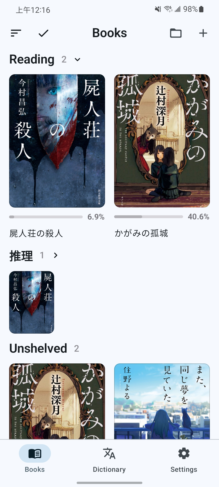</td>
    <td>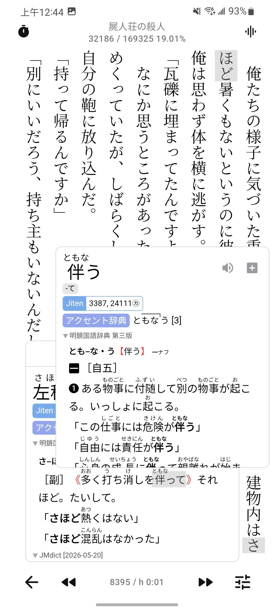</td>
    <td>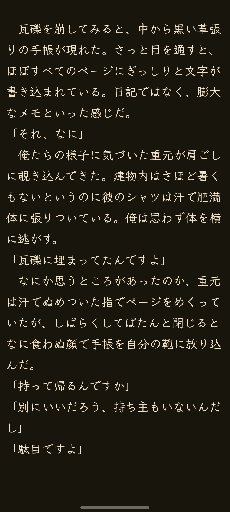</td>
    <td>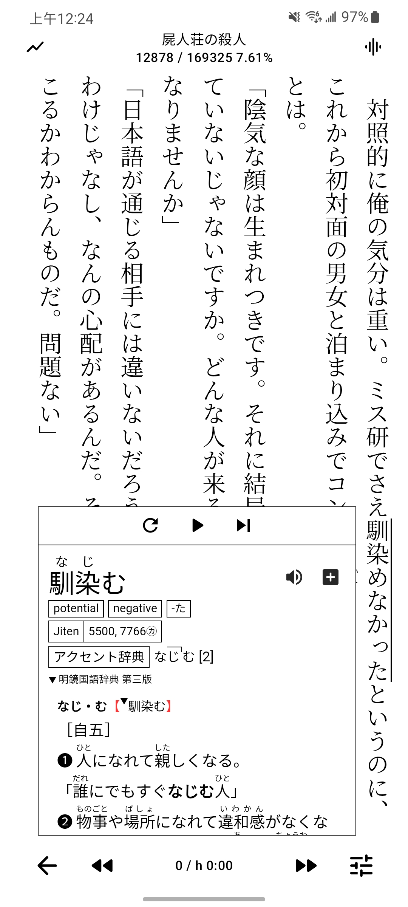</td>
  </tr>
  <tr>
    <td>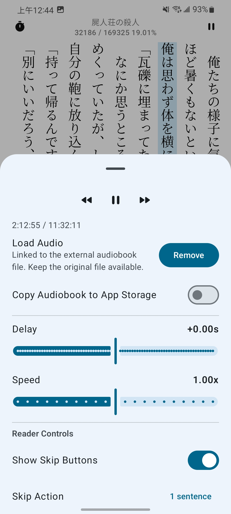</td>
    <td>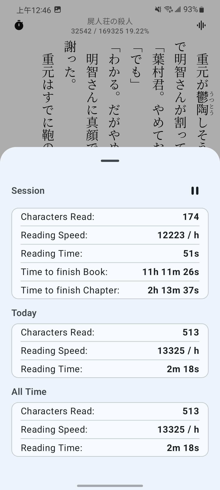</td>
    <td>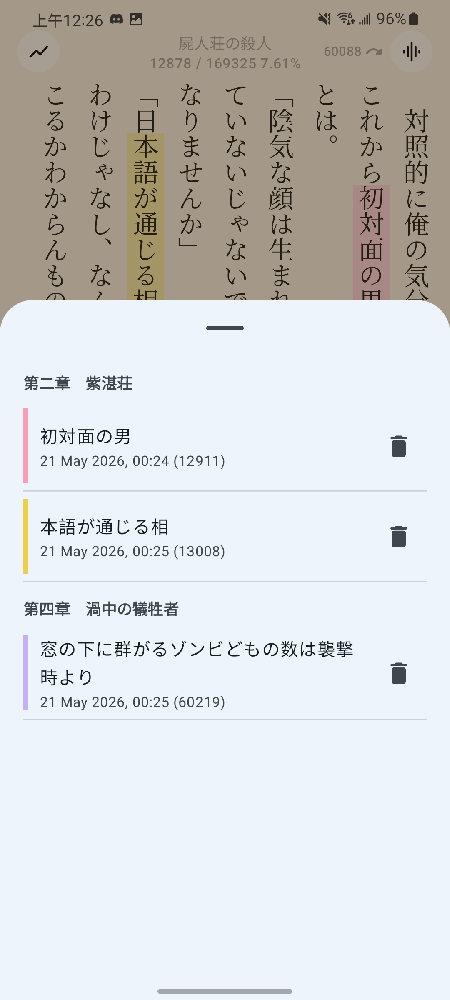</td>
    <td>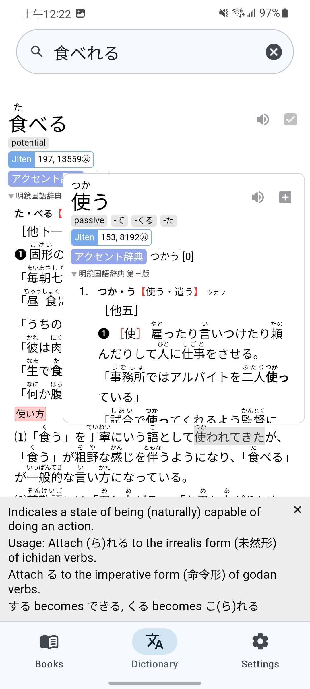</td>
  </tr>
  <tr>
    <td>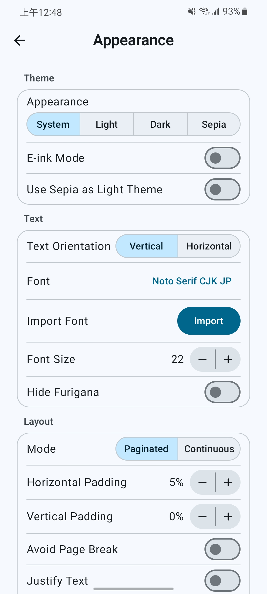</td>
    <td>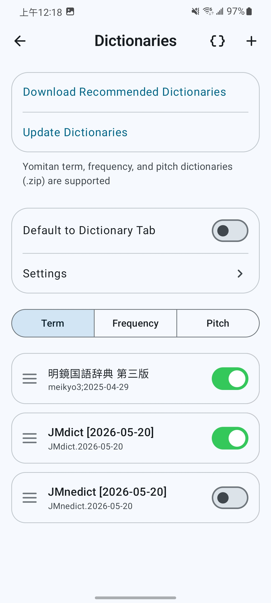</td>
    <td>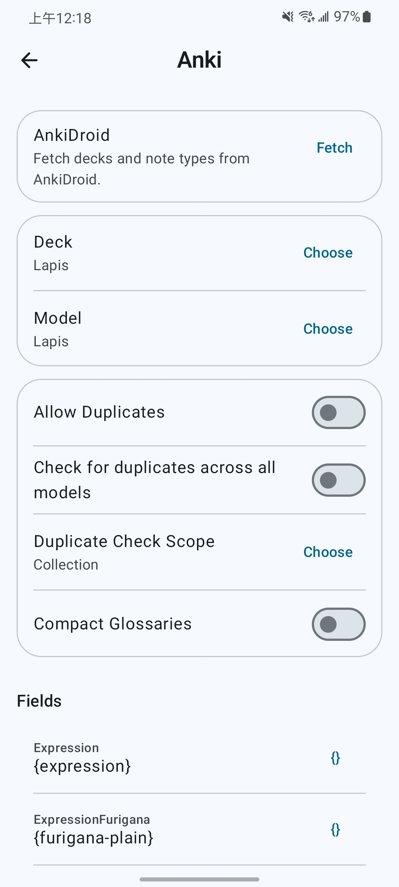</td>
    <td>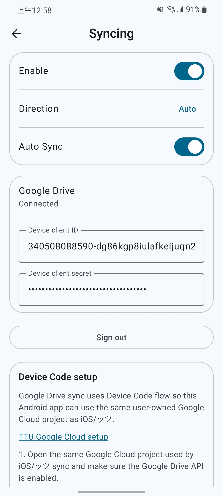</td>
  </tr>
  <tr>
    <td></td>
    <td></td>
    <td></td>
    <td></td>
  </tr>
</table>

## Features

### Bookshelf
- Import EPUBs individually, in batches, or recursively from folders, and keep reading progress visible from the bookshelf.
- Organize books with custom shelves.
- Export EPUBs or pull remote synced books back into the local library.

### Reading
- Read Japanese books in vertical or horizontal text, with paginated or continuous scrolling.
- Customize themes, fonts, paragraph spacing, and reader controls, including custom reader themes.
- Use immersive focus mode, volume-key page turning, and e-ink display options.
- Open reader images in fullscreen with zoom, copy, save, and share actions.

### Lookup
- Import, download, update, and manage Yomitan dictionaries.
- Tap text in the reader, search from the Dictionary tab, or look up selected text from other Android apps.
- Tap unknown words inside definitions for recursive lookup.
- Inject custom CSS styles.
- Use online or local word audio.

### AI Translation
- Translate vocabulary or sentences directly from the reader or lookup popup using Gemini models (such as `gemini-2.5-flash`, `gemini-2.5-pro`, or `gemini-3-flash-preview`).
- Configure personal Gemini API keys, target translation languages, auto-translation triggers, and select specific AI models.

### Highlights And Statistics
- Add five-color highlights while reading and jump to them at any time.
- Track reading statistics, including characters read, time spent, and reading speed, with live display while reading.

### Anki Card Mining
- Create cards through AnkiDroid or AnkiConnect.
- Use [Lapis](https://github.com/donkuri/lapis)-compatible fields, duplicate checks, and media export.
- Track all previously mined words and their creation dates inside the mining history log.

### Audiobook Read-Along
- Match audiobook subtitle files to book text to highlight the current sentence.
- Follow highlights with automatic page turning.
- Control playback speed, skip actions, and Android media controls.

## Privacy And Data
Nhut Reader Android stores imported books, dictionaries, fonts, audiobook data, reading progress, highlights, statistics, and settings locally in app storage.

Google Drive sync uses a user-configured Google Cloud OAuth device-code flow. Anki card mining talks to AnkiDroid or the configured AnkiConnect endpoint. Update checks read GitHub release metadata. Firebase integration is utilized for crash reporting and app stability diagnostics.

## Attribution
Nhut Reader Android builds on this ecosystem:
- [hoshidicts](https://github.com/Manhhao/hoshidicts) and [hoshidicts-kotlin-bridge](https://github.com/Manhhao/hoshidicts-kotlin-bridge) for Yomitan dictionary support.
- [Yomitan](https://github.com/yomidevs/yomitan) for dictionary format and lookup inspiration.
- [AnkiDroid](https://github.com/ankidroid/Anki-Android) for Android card creation integration.
- [Ankiconnect Android](https://github.com/KamWithK/AnkiconnectAndroid) for local audio behavior and AnkiDroid duplicate scope/checksum query references.
- [ッツ Ebook Reader](https://github.com/ttu-ttu/ebook-reader) for reader, statistics, and sync compatibility references.

## License
Distributed under the GNU General Public License v3.0. See [LICENSE](LICENSE) for details.
