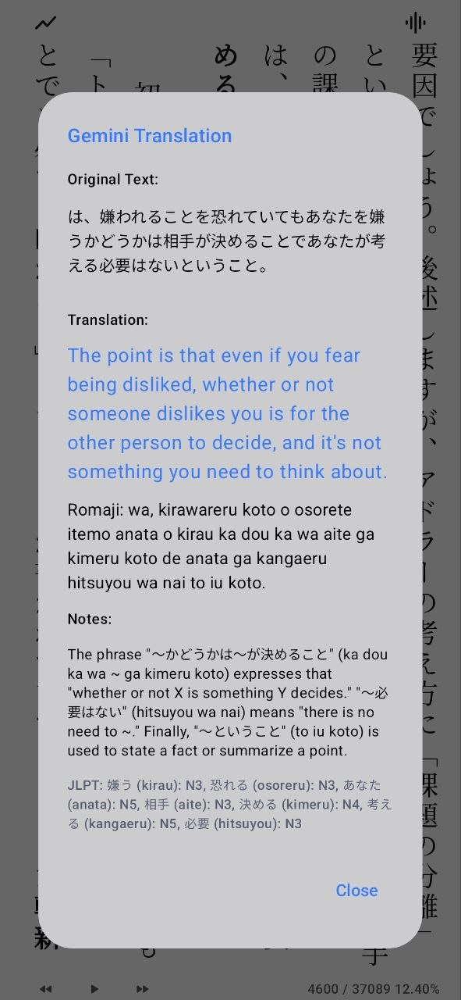
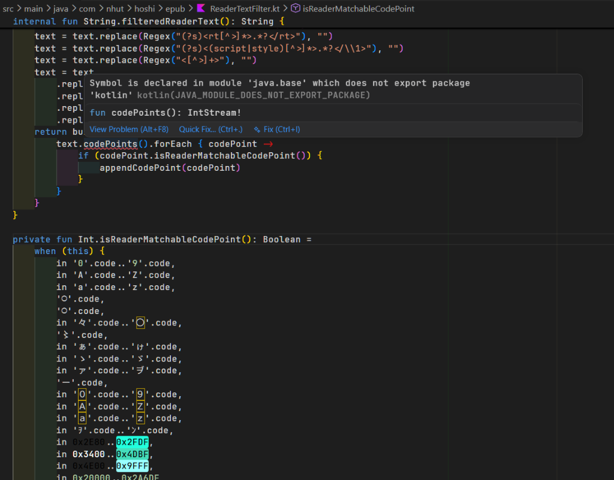
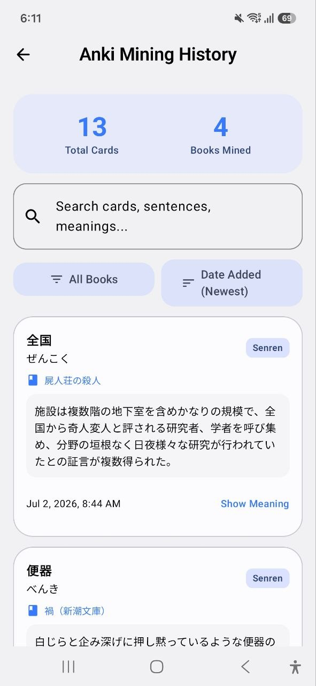
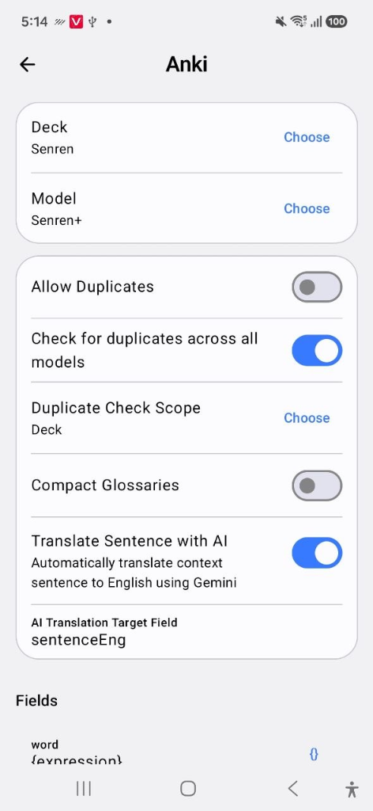

# Nhut Reader

[English](README.md) | **Tiếng Việt**

Nhut Reader là trình đọc sách EPUB tiếng Nhật dung lượng nhẹ, tối giản dành cho hệ điều hành Android. Được thiết kế tối ưu cho phương pháp Immersion (đắm mình ngôn ngữ), ứng dụng hỗ trợ tích hợp từ điển Yomitan, tạo thẻ Anki trực tiếp, đồng bộ sách nói (Sasayaki), dịch thuật thông minh bằng trí tuệ nhân tạo (AI), và tối ưu hóa hiển thị cho màn hình giấy điện tử (E-ink).

<table>
  <tr>
    <td></td>
    <td></td>
    <td></td>
    <td></td>
  </tr>
  <tr>
    <td></td>
    <td></td>
    <td></td>
    <td></td>
  </tr>
  <tr>
    <td></td>
    <td></td>
    <td></td>
    <td></td>
  </tr>
  <tr>
    <td></td>
    <td></td>
    <td></td>
    <td></td>
  </tr>
</table>

## Tính Năng Nổi Bật

### Quản Lý Kệ Sách & Thư Viện
- Nhập tệp EPUB riêng lẻ, nhập hàng loạt, hoặc quét tự động đệ quy từ các thư mục.
- Hiển thị phần trăm tiến độ đọc trực tiếp trên ảnh bìa sách.
- Phân loại và tổ chức thư viện cá nhân bằng các kệ sách tự tạo.
- Xuất file EPUB hoặc tải sách đã đồng bộ từ máy chủ lưu trữ từ xa về máy.

### Trải Nghiệm Đọc Sách Chuyên Sâu
- Đọc văn bản tiếng Nhật theo chiều dọc (truyền thống) hoặc chiều ngang, với chế độ cuộn liên tục hoặc phân trang.
- Tùy chỉnh khoảng cách lề, khoảng cách dòng, phông chữ hệ thống/phông chữ tùy chỉnh, và các chủ đề đọc sách đa dạng (Sáng, Tối, Sepia).
- Hỗ trợ chuyển trang bằng phím âm lượng và tối ưu hóa hiển thị giảm tần số quét cho màn hình E-ink.
- Mở hình ảnh trong sách ở chế độ toàn màn hình để phóng to, sao chép, lưu, hoặc chia sẻ trực tiếp.

### Tra Cứu Từ Điển Yomitan Nâng Cao
- Tải xuống, nhập, cập nhật, và bật/tắt các bộ từ điển Yomitan định dạng ZIP trực tiếp trên thiết bị.
- Tra từ bằng cách chạm trực tiếp khi đọc, tìm kiếm thủ công trong tab Từ điển, hoặc chia sẻ văn bản bôi đen từ ứng dụng khác sang Nhut Reader.
- Nhấp vào các từ chưa biết trong phần giải thích nghĩa của từ điển để tiếp tục tra cứu đệ quy đa tầng.
- Nhúng CSS tùy chỉnh cho popup nghĩa, chọn nguồn phát âm thanh từ vựng trực tuyến hoặc cục bộ.

### Dịch Thuật Bằng Trí Tuệ Nhân Tạo (AI)
- Dịch từ vựng hoặc cả câu trực tiếp từ sách hoặc popup từ điển bằng các mô hình Gemini (như `gemini-2.5-flash`, `gemini-2.5-pro`, hoặc `gemini-3-flash-preview`).
- Tự động kích hoạt dịch khi chọn từ hoặc câu.
- Tự động định dạng câu dịch khi tạo thẻ Anki để làm nổi bật từ khóa chính (bọc câu trong lớp `...` và từ khóa chính trong lớp `...`).

### Đánh Dấu & Thống Kê Học Tập
- Đánh dấu văn bản với 5 màu sắc khác nhau, dễ dàng chuyển nhanh đến các đoạn đã đánh dấu.
- Đo lường số ký tự đã đọc, thời gian đọc, và tốc độ đọc trung bình, hiển thị ngay trên thanh công cụ khi đang đọc.

### Đồng Bộ Đám Mây Firebase
- Đăng nhập và bảo mật tài khoản bằng Firebase Auth qua tài khoản Google.
- Tự động đồng bộ và sao lưu các đoạn đánh dấu (highlights) kèm ghi chú cá nhân lên Cloud Firestore.
- Sao lưu lịch sử dịch thuật thời gian thực để lưu giữ toàn bộ câu đã tra cứu.

### Tạo Thẻ Từ Vựng Anki (Mining)
- Tạo thẻ tức thời qua ứng dụng khách AnkiDroid cục bộ hoặc máy chủ AnkiConnect.
- Tự động điền dữ liệu theo mẫu trường tùy chỉnh (tương thích với định dạng Lapis).
- Tránh tạo thẻ trùng lặp bằng cách truy vấn mã checksum đã ký và chưa ký trên toàn bộ bộ sưu tập hoặc deck cụ thể.
- Quản lý lịch sử các từ đã mine kèm thời gian tạo cụ thể trong tab Lịch sử Mine từ.

### Nghe Sách Nói Đồng Bộ (Sasayaki)
- Khớp tệp phụ đề (SRT/WebVTT) của sách nói với văn bản EPUB để tự động làm nổi bật câu đang phát.
- Tự động cuộn trang hoặc lật trang sách để khớp với tốc độ đọc của âm thanh.
- Điều chỉnh tốc độ phát, tua nhanh/tua lại câu, liên kết trực tiếp với thanh thông báo hệ thống của Android (MediaSession).

## Quyền Riêng Tư & Dữ Liệu
Nhut Reader lưu trữ toàn bộ sách, từ điển, phông chữ, tiến độ đọc, đánh dấu, thống kê, và cài đặt cục bộ trên thiết bị của bạn.

- **Google Drive**: Sử dụng giao thức xác thực OAuth Device-Code để kết nối và đồng bộ tệp qua tài khoản Drive cá nhân.
- **Anki**: Chỉ kết nối và trao đổi dữ liệu với ứng dụng AnkiDroid cục bộ hoặc cổng kết nối AnkiConnect do bạn cấu hình.
- **Firebase**: Sử dụng Firebase để báo cáo lỗi crash hệ thống và đồng bộ lịch sử dịch thuật/đánh dấu trên mây.

## Đóng Góp Tham Chiếu
Nhut Reader được xây dựng dựa trên sự đóng góp của các dự án nguồn mở:
- [hoshidicts](https://github.com/Manhhao/hoshidicts) và [hoshidicts-kotlin-bridge](https://github.com/Manhhao/hoshidicts-kotlin-bridge) hỗ trợ định dạng từ điển Yomitan.
- [Yomitan](https://github.com/yomidevs/yomitan) khơi nguồn cảm hứng thiết kế định dạng từ điển và tra cứu đệ quy.
- [AnkiDroid](https://github.com/ankidroid/Anki-Android) hỗ trợ giao tiếp tạo thẻ từ vựng Android.
- [Ankiconnect Android](https://github.com/KamWithK/AnkiconnectAndroid) tham khảo hành vi âm thanh và kiểm tra trùng thẻ AnkiDroid.
- [ッツ Ebook Reader](https://github.com/ttu-ttu/ebook-reader) tham khảo cấu trúc trình đọc, thống kê và tương thích đồng bộ.

## Bản Quyền
Phát hành dưới Giấy phép Công cộng GNU v3.0. Xem chi tiết tại [LICENSE](LICENSE).
